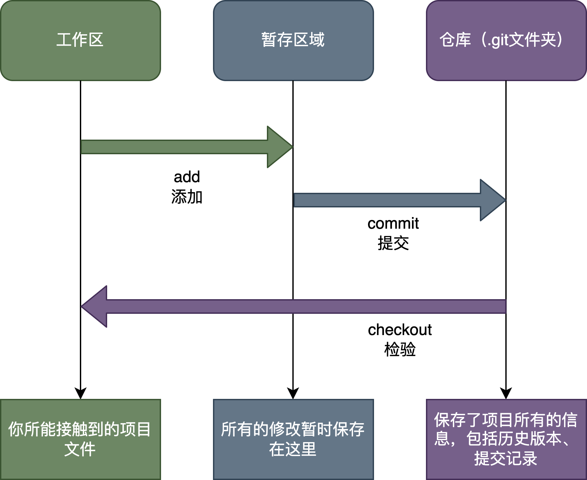
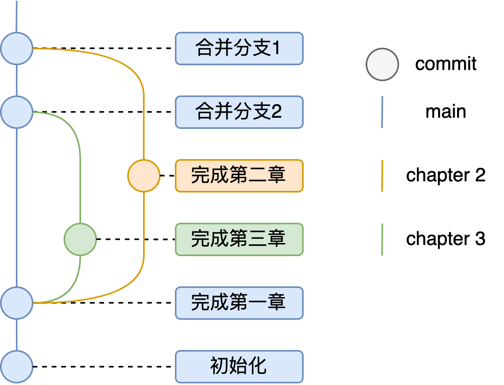
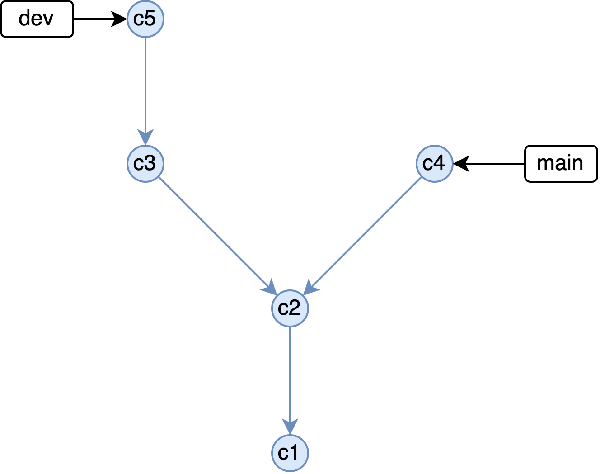
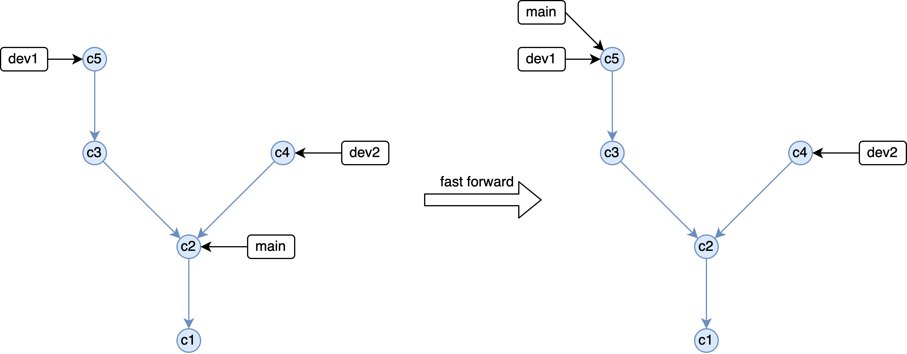
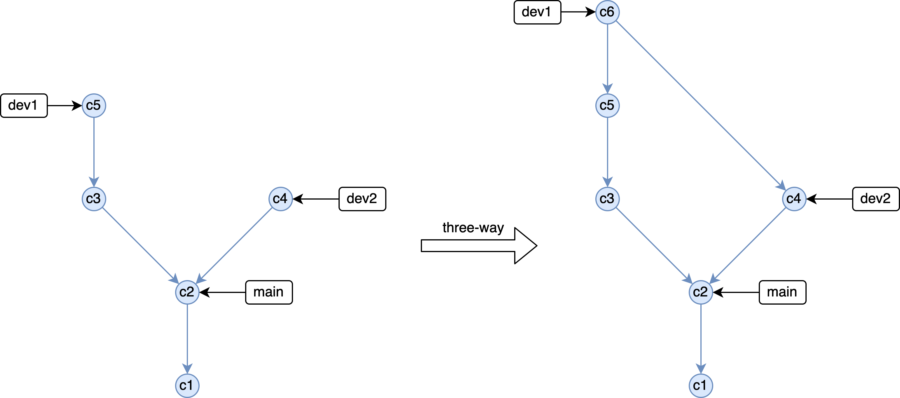
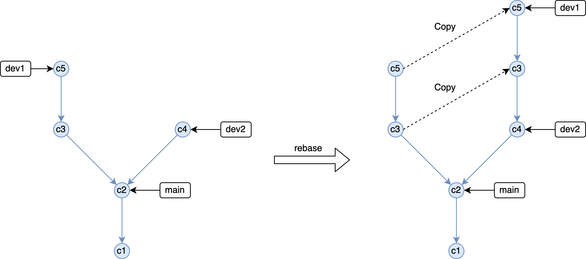
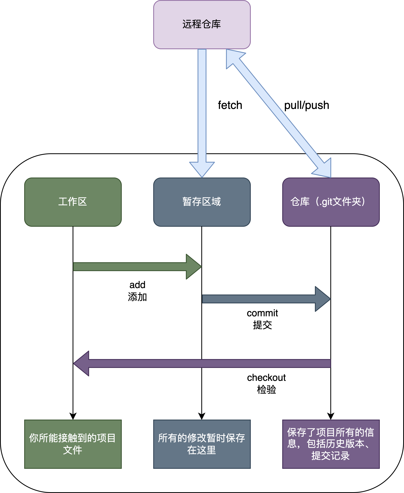

# Git 基础

-   [Git 的基本原理](#git-的基本原理)
    -   [介绍](#介绍)
    -   [命令行](#命令行)
-   [Git 分支](#git-分支)
    -   [介绍](#介绍-1)
        -   [分支](#分支)
        -   [分支合并](#分支合并)
        -   [分支冲突](#分支冲突)
    -   [命令行](#命令行-1)
-   [远程仓库](#远程仓库)
    -   [介绍](#介绍-2)
    -   [命令行](#命令行-2)

## Git 的基本原理

### 介绍

Git 事实上是一个本地的版本管理系统，你可以完全不联网地使用它。在你的本地某一个项目目录中，Git 将其分为三个部分

-   工作区
-   暂存区
-   仓库

<div align=center>
    
</div>

其中，工作区就是我们最为熟悉的文件目录了，即便不适用 Git，工作区也是存在的。在这里我们可以任意地添加、删除、修改文件，只不过没有 Git 的话，工作区的改动是不会保存下来的。

而暂存区用来保存临时做出的改动。需要注意的是，尽管称作临时改动，但是实际上相应的改动已经保存在文件系统中了，只是没有保存到 Git 中。

当我们执行 commit 命令后，暂存区域的所有改动就会正式地写入到仓库中（具体路径在当前目录下的`.git`文件夹中）。仓库中保存了该项目的所有信息，包括文件历史版本、历史提交记录等等信息。使用者可以随时从仓库中提取任意历史版本的文件。事实上，工作区的文件可以认为是从仓库中提取的最新版的项目记录。

从上面的介绍中我们可以发现，你执行的 Git 操作， 几乎只往仓库中 `添加` 数据。即便是我们在目录中删除了一个文件，具体到仓库中，也只是对应了一个`删除xx文件`的操作。至于这个被删除的文件，它仍存在于仓库中，只是被标记为已删除。如果你想，你仍然可以从仓库中提取出这个文件。换句话说，Git 几乎不会执行任何可能导致文件不可恢复的操作。

### 命令行

在了解了 Git 的基本工作原理后，Git 中的一些常用就显而易见了。

首先是初始化命令

```bash
git init
```

在工作区目录下运行该命令，Git 就会在当前目录下创建一个`.git`文件夹，用来保存仓库信息。

完成初始化之后，你可以使用

```bash
# 添加单个修改了的文件
git add <file>
```

或者

```bash
# 添加当前目录下的所有修改了的文件
git add .
```

来将工作区中的文件添加到暂存区。

当阶段性的工作完成后，你可以使用

```bash
git commit -m "commit message"
```

来将暂存区中的文件提交到仓库中。其中，`-m`后面的参数是提交信息，用来描述本次提交的内容。需要注意的是 `commit message` 是必须的，否则 Git 会报错。

如果想要检视项目的历史版本，则可以使用如下命令

```bash
# 查看某个文件的最近一次历史版本
git checkout <file>
# 查看某个文件的特定历史版本
git checkout <commit-id> <file>
# 切换到某个历史版本
git checkout <commit-id>
```

其中 `<commit-id>` 是提交的唯一标识符，是由 Git 自动生成的，可以通过 `git log` 命令查看。`<file>` 是文件名。可以使用如下命令恢复到最新的版本

```bash
# 恢复最新版本
git checkout <branch-name>
```

其中 `<branch-name>` 是分支名，这个我们后面再具体介绍。

## Git 分支

### 介绍

#### 分支

Git 的分支模型是其最为出色的特性之一，也正因为这一特性，使得 Git 从众多版本控制系统中脱颖而出。在前面的介绍中，我们提到，Git 仓库中保存了项目的所有历史版本，其实更准确地说是保存了项目所有分支的历史版本。当我们执行初始化命令`git init`时，Git 会默认创建一个名为`main`或者`master`的分支，并令其为主分支。

我们可以基于任意一个分支创建新的分支，创建出来的新分支会包含原分支的所有历史版本，并且在新的分支上做的改动不会影响到原分支。我们还可以随时在分支之间切换，当执行分支切换的指令后，Git 会从仓库中提取对应的数据到工作区中，从而让用户能在新的分支上进行工作。当新分支上的工作完成后，我们可以将其合并到原分支上，这样原分支就会包含新分支的所有改动。

在项目开发中，我们通常会多个任务同时进行。比如，在写一本书的时候，多个章节可以同时进行。比如说，现在有一本书，共有三个章节，其中第一章已经写好了，接下来的两章需要交给两个不同的人来写。那么，我们可以将这本书的开发分为三个分支，分别是`main`、`chapter2`和`chapter3`。其中，`main`分支是主分支，包含了已经完成的第一章，而两个子分支则是从`main`分支拷贝而来的。当`chapter2`和`chapter3`分别完成后，我们就可以将它们合并到`main`分支上。

从下图中可以清晰地看到，仓库的第一次 commit 是在`main`分支上进行的，在完成第一章之后，我们创建了`chapter2`和`chapter3`两个分支，他们都是从`main`分支上拷贝而来的。当`chapter2`和`chapter3`分别完成后，我们就可以将它们合并到`main`分支上从而达到了多个任务同时进行且互不干扰的目的。

<div align=center>
    
</div>

这只是一个简单的例子，在这个例子中，即便是不用 Git 我们也能够很好地完成这个任务。但是，试想一下，如果这不是书本撰写，而是代码开发呢，新增一个功能往往涉及多个文件的改动。多个功能开发同时进行，如果不使用 Git 的分支功能，就会很容易出现冲突，导致开发进度大大降低。而使用 Git 的分支功能，就能够很好地解决这个问题。

在介绍分支合并之前，我们有必要了解一下 Git 中究竟是如何存储分支的。实际上，Git 并不存储每个分支的内容，而是存储了每次提交的信息，以及它们之间的互相依赖关系。比如，在下面这个图中，一共包含了 5 次提交，分别是 `c1, c2, ..., c5`。其中，`c1`是最初的提交，`c5`是最新的提交。每个提交都有一个父提交，比如`c2`的父提交是`c1`，`c3`的父提交是`c2`。而不同的分支则是指向不同的提交的指针，比如`main`分支指向`c4`，而`dev`分支指向`c5`。当单独查看某个分支的时候，Git 会从该分支指向的提交开始，沿着父提交的方向一直向前查找，直到找到最初的提交为止。这样，Git 就能够找到该分支的所有历史版本了。比如`main`分支的所有历史版本就是`c1, c2, c4`，而`dev`分支的所有历史版本就是`c1, c2, c3, c5`。

<div align=center>
    
</div>

#### 分支合并

接下来，我们来介绍三种常见的分支合并方法。

-   `fast-forward`合并

    `fast-forward`合并是最简单易懂的合并方式。比如下面这个仓库，包含了三个分支。我们希望将`dev1`分支合并到`main`分支中，这时候`fast-forward`合并只需要简单地将`main`分支指向`dev1`分支指向的`commit`即可。这样，`main`分支就包含了`dev1`分支的所有历史版本了。

    但我们也可以发现，`fast-forward`要求被合并的两个分支之间要有直接的父子关系，否则就无法进行`fast forward`合并。比如，我们希望将`dev2`分支合并到`dev1`分支中，但是`dev2`与`dev1`分支分叉了：两者都继承自`main`分支。但是`dev1`分支额外包含了`c3,c5`两次提交，而`dev2`分支没有包含这两次提交，且有一个额外的`c4`提交。因此，`dev2`分支无法直接合并到`dev1`分支中，这时候，我们就需要使用第二种合并方式。

      <div align=center>
          
      </div>

-   `three-way`合并

    `three-way`合并是最常用的合并方式，通常也是默认的合并选项。`three-way`合并的原理是，Git 会找到两个分支的最近的共同祖先，然后将这个共同祖先与两个分支的差异分别进行合并，最后生成一个新的提交。比如，我们希望将`dev2`分支合并到`dev1`分支中，那么 Git 会找到`dev1`和`dev2`分支的最近的共同祖先`c2`，然后将`c2`与`dev1`分支的差异和`c2`与`dev2`分支的差异分别进行合并，最后生成一个新的提交。这样，`dev1`分支就包含了`dev2`分支的所有历史版本了。

    可以看到，当`dev2`分支合并到`dev1`分支后，Git 会生成一个新的提交`c6`，并将`dev1`分支指向`c6`。并且在查看`dev1`分支的历史版本时，`dev1`中原本的提交`c3,c5`和`dev2`中的提交`c4`都会被包含在内，并按照时间顺序排列。也就是说，合并后的`dev1`包含了`c1, c2, c3, c4, c5, c6`这 6 次提交。

      <div align=center>
          
      </div>

-   `rebase`合并

    `rebase`合并是另一种常用的合并方式。`rebase`合并的原理是，Git 会找到两个分支的最近的共同祖先，然后将目标分支在共同祖先之后的提交全部复制一份，然后将这些提交添加到被合并分支的最后。比如，我们希望将`dev2`分支合并到`dev1`分支中，那么 Git 会找到`dev1`和`dev2`分支的最近的共同祖先`c2`，然后将`dev1`在`c2`之后的所有提交都复制一份，然后将这些提交添加到`dev2`分支的最后。这个操作用英文来说就是`rebase dev1 onto dev2`，这么来看是不是就很清楚了。

      <div align=center>
          
      </div>

    可以看到`rebase`合并并不会产生额外的提交，且能够保证提交的线性结构。但是需要注意的是`rebase`会打乱提交的顺序，比如在上面的例子中，`dev1`的历史记录为`c1,c2,c4,c3,c5`。

这三种分支合并方式各有优缺点，我们在实际使用中可以根据需要选择不同的合并方式。

-   `fast-forward` 往往用在没有分叉的两个分支之间，比如发现主分支的代码中出现了 bug，我们可以新建一个分支用于紧急修复 bug，然后将修复 bug 的分支合并到主分支中。这时候，`fast-forward`合并就很适合。
-   `thrre-way` 这是最常用的合并方式，它能够清晰地保存合并前后的历史记录，保留各分支之间的历史路线。
-   `rebase` 通常用在将主分支的内容合并到开发分支中，这样可以避免开发分支中出现主分支的提交，使得开发分支的历史记录更加清晰。比如，我们在开发分支中开发了一个新功能，但是在开发过程中，主分支中的代码也发生了变化，这时候，我们可以使用`rebase`将主分支的代码合并到开发分支中。

#### 分支冲突

在多分支同步开发时，有的时候会出现冲突。比如`dev1`和`dev2`都是基于`main`分支进行开发的，但是这两个开发分支都对同一个元素进行了修改。这时问题就出现了，最终这两个分支合并到`main`分支的时候，这个元素究竟要采用哪个开发分支的修改呢？这就是冲突，是需要人工介入解决的。

在这里我们不详细介绍如何解决冲突，因为使用 VSCode 时，可以直接利用 GUI 解决冲突，使用起来非常直观方便。

### 命令行

在当前所处的分支上创建一个名称为 `<new-branch-name>`的新分支:

```bash
git branch <new-branch-name>
```

如需切换分支，则可以使用`switch`命令：

```bash
git switch -c <new-branch-name>
```

要删除本地分支，可以使用以下命令：

```bash
git branch -d <branch_name>
```

这将删除名为<branch_name>的本地分支。如果该分支还没被合并到其他分支，那么会提示您是否强制删除。强制删除请使用以下命令：

```bash
git branch -D <branch_name>
```

合并指定分支到当前分支

```bash
git merge <branch_name>
```

如果两个分支没有分叉，那么 Git 会执行`fast-forward`合并，如果两个分支有分叉，那么 Git 会执行`three-way`合并。

使用`rebase`合并指定分支到当前分支

```bash
git rebase <branch_name>
```

## 远程仓库

### 介绍

远程仓库大大方便了多人合作，它可以看作是一个云盘，能将本地的仓库在远程备份一份。所有合作者都可以从远程仓库中拷贝一份到本地，从而进行进一步的开发。与此同时，所有的本地修改都可以同步到远程分支，供其他用户使用。

<div align=center>
    
</div>

利用`fetch`指令可以将远程仓库中新的提交拉取到本地的暂存区，之后可以使用`merge`将暂存区的内容保存到仓库里。当然也可以直接使用`pull`指令，它相当于`fetch+merge`，直接将远程分支中的更新同步到本地。而使用`push`命令则可以将本地仓库中新更新的内容推送到远程仓库。

### 命令行

使用如下命令将远程仓库完整地拷贝到本地

```bash
git clone <url>
```

使用如下命令为添加远程仓库，并将远程仓库命名为`<remote>`

```bash
git remote add <remote> <url>
```

使用`pull`命令将远程仓库的内容同步到本地

```bash
git pull <remote>
```

使用`push`命令将本地分支推送到远程仓库

```bash
git push <remote> <local-branch>
```
