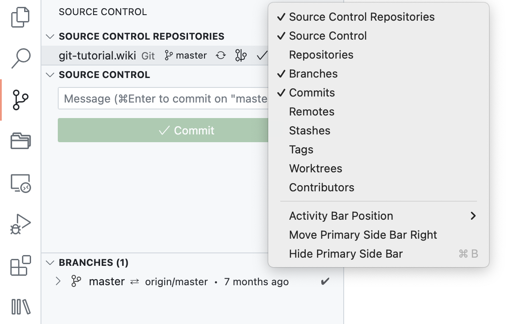

# 在 VSCode 中使用 Git

首先推荐安装插件 `GitLens`：

<div align=center>
    
</div>

-   [克隆 Git Repository](#克隆-git-repository)
-   [初始化 Git Repository](#初始化-git-repository)
-   [添加远程仓库](#添加远程仓库)
-   [提交 commit](#提交-commit)
-   [新建、切换和删除分支](#新建切换和删除分支)
-   [分支 `Rebase`](#分支-rebase)

## 克隆 Git Repository

点击右侧插件按钮，选择 `Clone Repository`

<div align=center>
    
</div>

输入 Git 仓库地址，点击 `Clone from URL ...`

<div align=center>
    
</div>

选择保存路径

<div align=center>
    
</div>

选择打开，或者在新的窗口打开

<div align=center>
    
</div>

可以从文件目录看到已经克隆好的 Git 仓库

<div align=center>
    
</div>

从 Source Control 一栏中则可以看到具体信息

<div align=center>
    
</div>

右击最顶部 `SOURCE CONTROL`，建议只保留以下几项

<div align=center>
    
</div>

## 初始化 Git Repository

任意打开一个文件夹作为工作区，并切换到 `Source Control` 一栏，可以看到有初始化的选项：

<div align=center>
    
</div>

点击后如图所示：

<div align=center>
    
</div>

由于此时并没有添加对应的远程仓库，所以实际上并不能发布分支，具体操作见后续章节。

## 添加远程仓库

点击仓库名最右侧三个小点，选择 `Add Remote`

<div align=center>
    
</div>

填写对应的`URL`即可

<div align=center>
    
</div>

## 提交 commit

如果你对仓库中的文件进行了修改、新增或删除，对应的记录都会显示在 `Source Control` 一栏中。

<div align=center>
    
</div>

填写对应的`commit message`，点击 `Commit` 就相当于同时运行了 `add` 和 `commit` 两个命令。

<div align=center>
    
</div>

此时，相应的文件已经被提交，可以在 `Source Control` 中 `COMMITS` 一栏中看到具体信息，并且可以看到对应的图标是箭头，这表示`commit`还没有同步到远程仓库：

<div align=center>
    
</div>

点击`Sync Changes`即可同步到远程仓库，需要注意的是，并不是每次`commit`都要同步，可以完成阶段性工作后统一同步。

<div align=center>
    
</div>

## 新建、切换和删除分支

点击 `BRANCHES` 一栏对应的加号即可

<div align=center>
    
</div>

输入分支名，选择对应的操作

<div align=center>
    
</div>

可以从 `SOURCE CONTROL REPOSITORIES` 一栏查看当前分支（当前是 `dev` 分支）

<div align=center>
    
</div>

鼠标移动到想要切换的分支上，点击对应图标可以完成切换（注意，分支名如果为绿色，则表明该分支还未被发布）

<div align=center>
    
</div>

右击分支，则会出现更多选项，包括删除分支（当前分支无法删除，并不会出现删除选项，需要切换到其他分支再进行删除）

<div align=center>
    
</div>

在开始任何修改前，请一定注意当前所在的分支是否是自己想要进行修改的分支。

## 分支 `Rebase`

在新建一个分支并做了修改之后，你才发现忘了同步主分支。换句话说，你是基于旧版本的文件进行修改的，此时就需要进行 `Rebase` 了。

<div style="display: flex;justify-content: center; flex-wrap: wrap;">
    <figure style="text-align:center;margin-right:30px;">
        
        <figcaption> (a) 本地仓库历史记录 </figcaption>
    </figure>
    <figure style="text-align:center;margin-right:30px;">
        
        <figcaption> (b) 远程仓库历史记录 </figcaption>
    </figure>
</div>
<div style="text-align: center;">
    <figcaption> 图1. 需要进行 `rebase` 的情况 </figcaption>
</div>

从图 1.a 中可以看到，本地仓库最近一次已同步的提交是在 7 个月前，而远程仓库则在最近有了新提交。如果本地忘了同步就进行了修改，则会提示有三个 `commit` 等待下载，一个 `commit` 等待上传

<div align=center>
    
</div>

如果此时点击`Sync Changes` 出现报错，则需要在命令行运行

```bash
# 当前目录下运行
git config pull.rebase true
# 或全局设置
git config --global pull.rebase true
```
