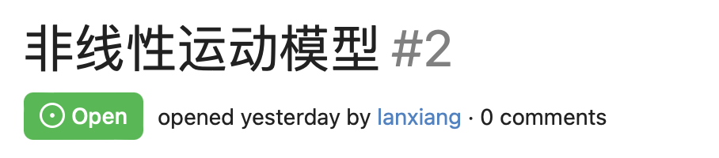
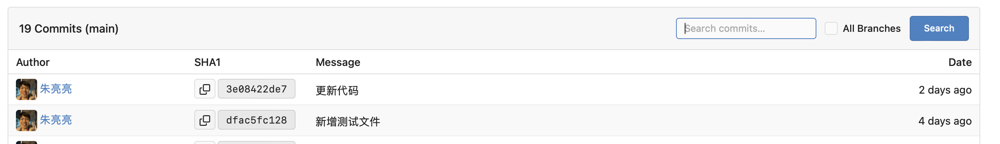
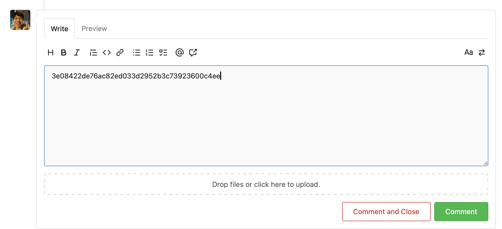
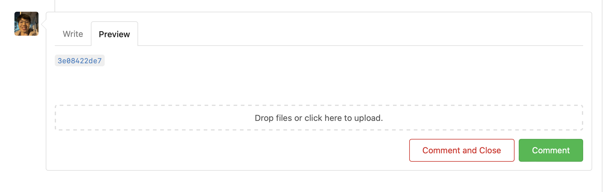
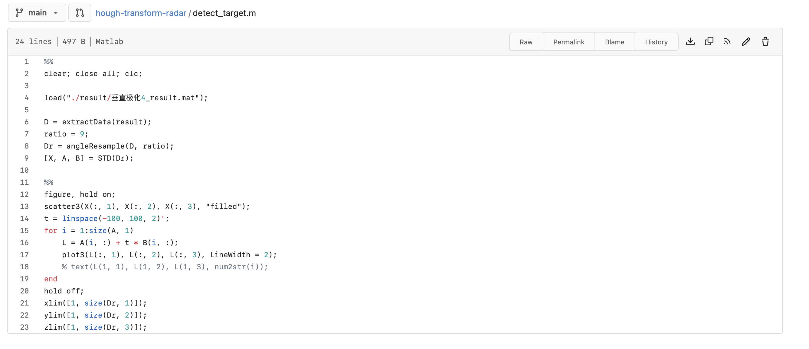
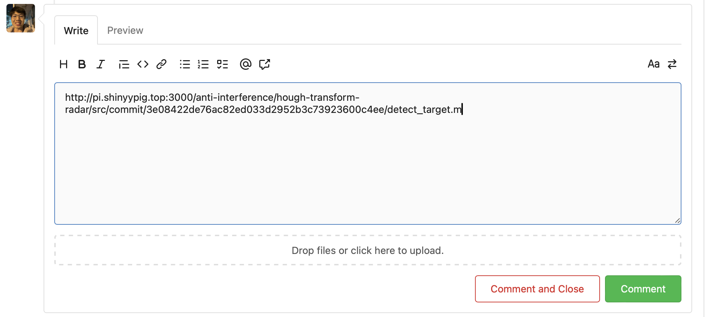
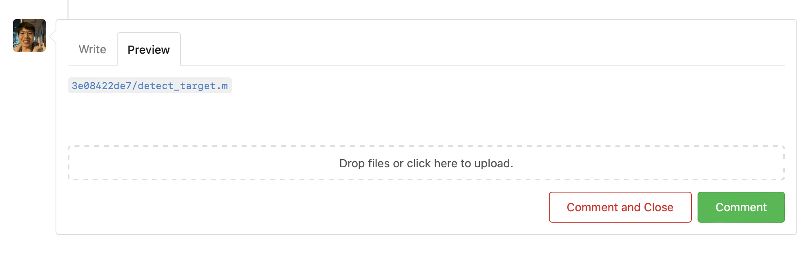
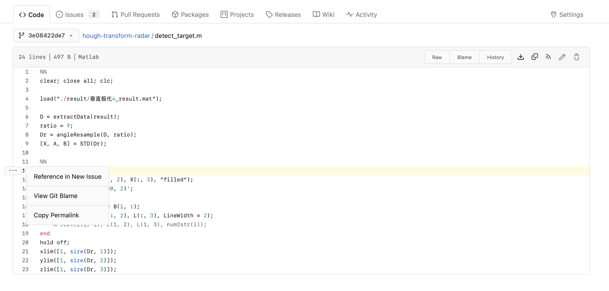
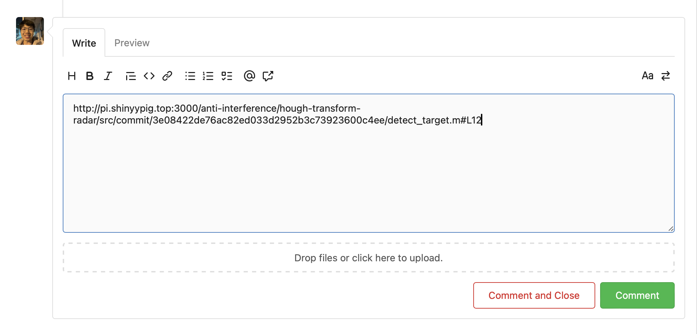
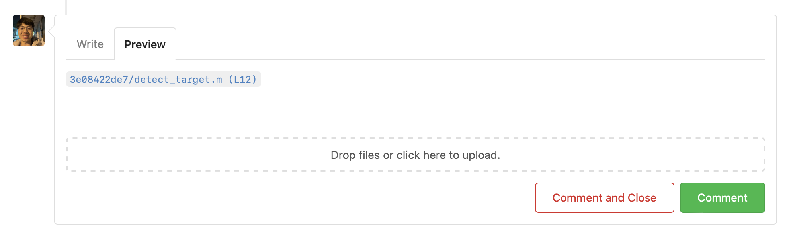

# Gitea Web 使用教程

网站上主要的操作有发起 `Pull Request` 和 `Issue` 等，这些不做过多介绍，本文主要如何进行交叉引用。

## commit message 引用

在提交的 commit message 中写上对应 issue 的标号，比如

```
Fix #2
```

即可引用序号为 `#2` 的 issue。

<div align=center>
    
</div>

## 在 issue 中引用 commit 或代码

复制 commit 的 SHA 粘贴到 issue 中即可：

<div align=center>
    
</div>

<div align=center>
    
</div>

<div align=center>
    
</div>

引用代码，首先需要打开对应文件，点击`permalink`，然后复制`url`即可

<div align=center>
    
</div>

<div align=center>
    
</div>

<div align=center>
    
</div>

引用代码特定行，首先需要打开对应文件，想要引用的行的行号，此时会出现三个点，点击`Copy Permalink`即可：

<div align=center>
    
</div>

<div align=center>
    
</div>

<div align=center>
    
</div>

## 多人合作规范

1. 主分支设置保护，不允许直接推送
2. 进行任何修改，都需要新建分支，然后合并
3. 有任何问题，尤其是涉及到技术细节的问题，必须在 issue 中提出，方便日后查阅
4. 多人合作时 commit message 以及 pull request 对应的信息必须明确指出所进行的工作
